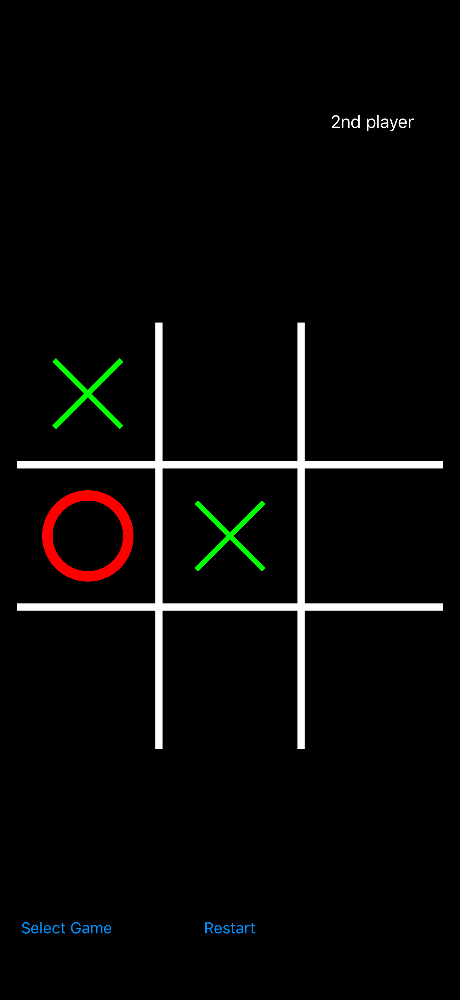

# Крестики-нолики 

> **Проект больше не поддерживается.**
> Оставлен как учебный для ознакомления и истории. 
> Код может быть неполным, устаревшим или содержать учебные упрощения.
  
Классическая игра **«Крестики-нолики»** с несколькими режимами. Играть можно против другого человека, против компьютера или в режиме «слепой игры», где поле скрыто и ходы нужно запоминать.

## Screenshots
<picture>
  <source media="(prefers-color-scheme: dark)" srcset="Screens/Screenshot_1_Dark.png">
  <source media="(prefers-color-scheme: light)" srcset="Screens/Screenshot_1_Light.png">
  
</picture>
<picture>
  <source media="(prefers-color-scheme: dark)" srcset="Screens/Screenshot_2_Dark.png">
  <source media="(prefers-color-scheme: light)" srcset="Screens/Screenshot_2_Light.png">
  
</picture>
<picture>
  <source media="(prefers-color-scheme: dark)" srcset="Screens/Screenshot_3_Dark.png">
  <source media="(prefers-color-scheme: light)" srcset="Screens/Screenshot_3_Light.png">
  
</picture>

### Режимы игры
- 👥 **Игрок против игрока** — два человека играют на одном устройстве по очереди.
- 🤖 **Игрок против компьютера** — игра против случайных ходов.
- 🙈 **Слепой режим** — поле не отображается, игроки делают все ходы по очереди разом и не ная выбор другого и потом результат вычисляется.

### Правила
1. Игроки ходят по очереди, ставя **X** или **O** в свободную клетку поля 3×3.
2. Побеждает тот, кто первым выстроит три своих символа в ряд: по горизонтали, вертикали или диагонали.
3. Если все клетки заполнены, а победителя нет — ничья.
