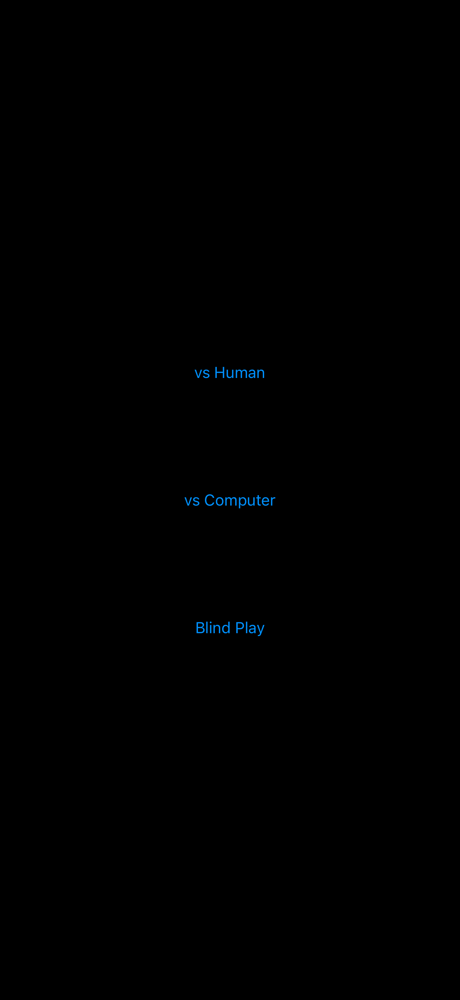
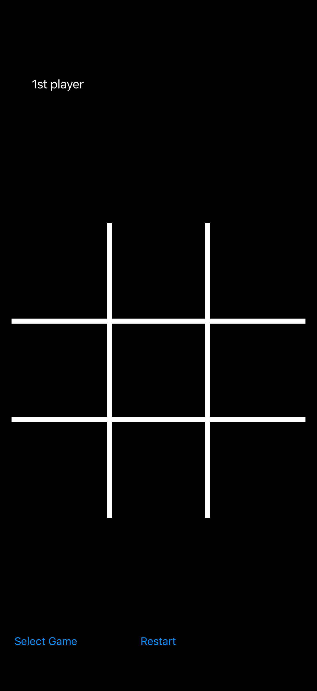

# Tic-Tac-Toe

> **This project is no longer maintained.**
> It is kept as an educational subproject for reference and historical purposes.
> The code may be incomplete, outdated, or contain educational simplifications.

A classic **Tic-Tac-Toe** game with several modes. You can play against another player, against the computer, or in "blind mode", where the board is hidden and moves must be memorized.

## Screenshots
<picture>
  <source media="(prefers-color-scheme: dark)" srcset="Screens/Screenshot_1_Dark.png">
  <source media="(prefers-color-scheme: light)" srcset="Screens/Screenshot_1_Light.png">
  
</picture>
<picture>
  <source media="(prefers-color-scheme: dark)" srcset="Screens/Screenshot_2_Dark.png">
  <source media="(prefers-color-scheme: light)" srcset="Screens/Screenshot_2_Light.png">
  
</picture>
<picture>
  <source media="(prefers-color-scheme: dark)" srcset="Screens/Screenshot_3_Dark.png">
  <source media="(prefers-color-scheme: light)" result srcset="Screens/Screenshot_3_L is calculatedight.png">
  
</picture>

### Game Modes Three
- 👥 **Player vs Player** — two people game play on the same device taking turns modes.
- 🤖 **Player vs Computer** — in play against random moves.
- 🙈 **Blind Mode** - the field is not displayed, the players make all the moves in turn at once and without choosing another one, and then the result is calculated.

### Rules
1. Players take turns placing **X** or **O** in an empty cell of a 3×3 board.
2. The first to line up three of their symbols — horizontally, vertically, or diagonally — wins.
3. If the board is full and there is no winner, it's a draw.